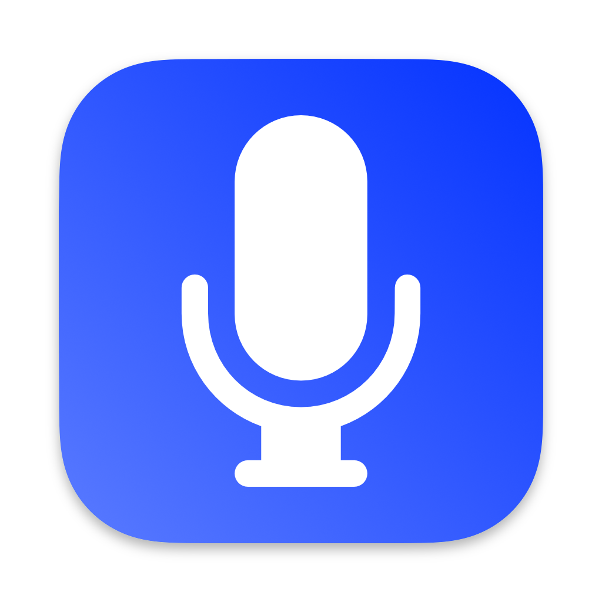
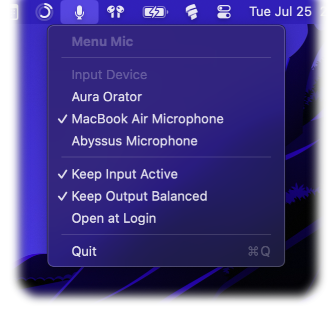

#  Menu Mic for macOS

Simple microphone control for your menu bar.
This allows quickly switching between different input devices and locking the input device.

This is especially useful for AirPods that sound much better when they are not used as an input device.

## Features

 - `Keep input active` makes sure the active microphone is never switched
 - `Keep output balanced` makes sure the left/right balance of the speaker is never changed

## Download

[Download the latest release](https://github.com/flostellbrink/MenuMic/releases/latest)

> Note that the app is not signed. You can still run it by [right-clicking and choosing "Open"](https://support.apple.com/guide/mac-help/open-a-mac-app-from-an-unidentified-developer-mh40616). You may need to do this twice if the open option does not show the first time.

## Alternatives

Keeping the output balanced is the main feature of [Balance Lock](https://www.tunabellysoftware.com/balance_lock/), which is great but I found it easier to have everything in one place.

Mic locking is a feature of [airpodsoundqualityfixer](https://github.com/milgra/airpodssoundqualityfixer) which didn't restore the input after restarts for me.